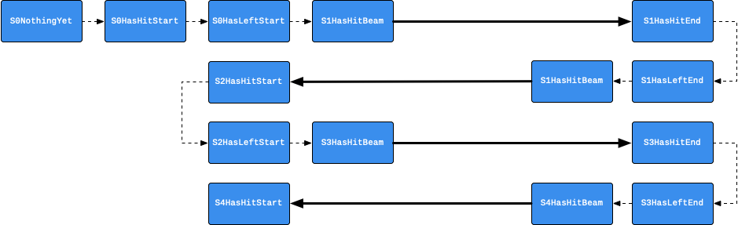

# Dataset

This folder contains the raw collected dataset of "Walk this Beam" study.

## Experiment conditions

Methods:

1. **No instructions**: a user walk through the beam without aids
2. **Imitation**: a user walk through the beam by imitating a virtual ghost character
3. **Gamification**: a user walk through the beam by interacting with a gamified mechanism (i.e. collect beacons).

Tides:

1. **High** tide: the beam is on top of the tide and far away from it (high danger/height)
2. **Low** tide: the beam is on top of the tide and comparably much closer to the tide (low danger/height)

## Details

Each sub-folder is named as a number which represents the participant ID.

### `*state.csv`

This file is used to parse the duration of a lap. In each condition pair of experiment method and tide, there are 4 laps.

| name      | explain |
|:----------|:--------|
| timestamp | the unix time stamp of the current row being recorded |
| state     | the progress state |

All possible states are visualized as follows:

### `*laps.csv`

This file can be inferred from `*state.csv`

| name      | explain |
|:----------|:--------|
| timestamp | the unix time stamp of the current row being recorded |
| lap       | the lap count |
| time      | time spent in the lap (ms) |

### `*steps.csv`

| name | explain |
|:-----|:--------|
| timestamp | the unix time stamp of the current row being recorded |
| foot      | the foot stepped on the slack line |
| position            | the progress percentage of a whole lap |

### `*falls.csv`

| name | explain |
|:-----|:--------|
| timestamp | the unix time stamp of the current row being recorded |
| duration            | the duration of a person falled (ms) |
| position            | the progress percentage of a whole lap |
| round               | the lap count |

### `*motion*.csv`

| name      | explain |
|:----------|:--------|
| pID       | participant ID |
| timestamp | the unix time stamp of the current row being recorded |
| trackable | trackable object |
| posX      | X position |
| posY      | Y position |
| posZ      | Z position |
| rotX      | X rotation |
| rotY      | Y rotation |
| rotZ      | Z rotation |

### `*ECG.csv`

ECG data is collected using **[Polar H10](https://www.polar.com/de/produkte/accessoires/herzfrequenz_sensor_h10)**.

| name      | explain |
|:----------|:--------|
| timestamp | the unix time stamp of the current row being recorded |
| ECG       | The ECG raw data record |

Health indicators:

- Low HR and stable HRV in healthy
- Exercise (Recovery of HR and HRV)
- Stress (Increased LF components)

### `*EDA.csv`

EDA data is collected using **[BITalino](https://bitalino.com/storage/uploads/media/electrodermal-activity-eda-user-manual.pdf)**.

EDA is a frequently used measure as it is non-invasive and responds quickly to emotional and psychological stimuli.

| name      | explain |
|:----------|:--------|
| timestamp | the unix time stamp of the current row being recorded |
| EDA       | The EDA raw data record |

References:

- https://neurokit2.readthedocs.io/en/latest/examples/eda.html

### `*IPQ*.csv`

**iGroup Presence Questionnaire** (IPQ) scale: [1, 7]

| name      | explain |
|:----------|:--------|
| QuestionType | The type of the question |
| Question     | The content of the question |
| QuestionID   | The question ID |
| Answer       | The answer |

### `*NASATLX*.csv`

Raw **NASA-TLX** scale: [0, 20]

| name      | explain |
|:----------|:--------|
| QuestionType | The type of the question |
| Question     | The content of the question |
| QuestionID   | The question ID |
| Answer       | The answer |

### `*PACES*.csv`

**Physical and Activity and Enjoyment Scale** PACES scale: [1, 7]

| name      | explain |
|:----------|:--------|
| QuestionType | The type of the question |
| Question     | The content of the question |
| QuestionID   | The question ID |
| Answer       | The answer |

### `meta.csv`

| name      | explain |
|:----------|:--------|
| user_id             | participant ID |
| age                 | age of participant |
| gender              | gender of participant |
| occupation          | reported occupation |
| need_glasses        | need glasses regularly |
| keep_glasses        | need glasses in VR |
| blurred_preceiving  | the experiment is experienced under blurred vision or not|
| game_experience     | hours/week game experience |
| vr_experience       | hours/week VR experience |
| training_need       | balance training needs |

### `order.csv`

This file records the experiment order for each of the participants.

| name      | explain |
|:----------|:--------|
| user_id   | participant ID |
| tide_a    | 1st tide condition |
| tide_b    | 2nd tide condition |
| order_a   | 1st experiment method |
| order_b   | 2nd experiment method |
| order_c   | 3rd experiment method |

### `level.csv`

This file records the subjective evaluation (done by Dennis) on the participant's expertise in balancing.

| name      | explain |
|:----------|:--------|
| pid   | participant ID |
| level | expertise level; expert (1), intermediate (2), novice (3) |

The `level` is determined based on two questions:

1. Hours of VR expeirence per week
2. VR devices experienced

The two questions are converted to three levels of VR experience: none, medium, experienced.
